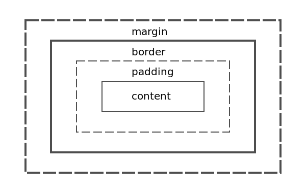
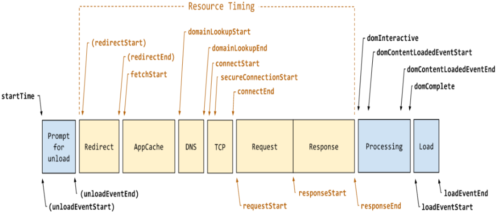
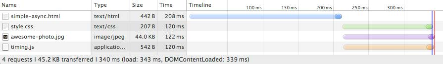
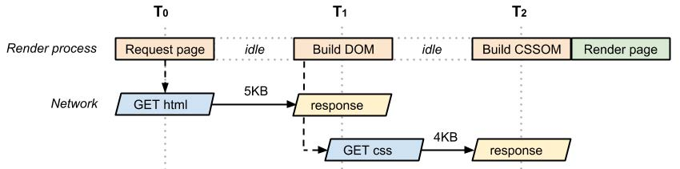
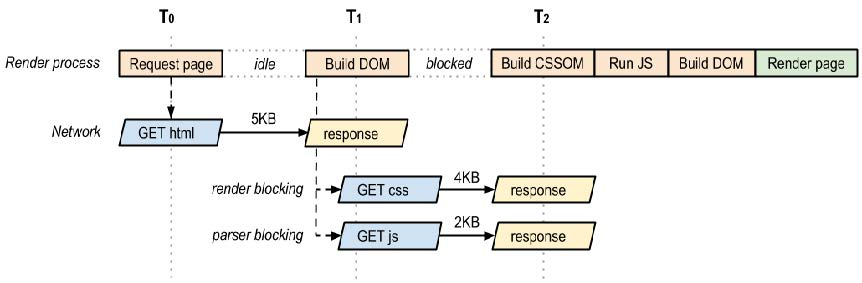

# 押题
---
## week 1 how web works
- protocol is a set of rules that partners in communication use when they communicate.
- TCP ensures that transmissions arrive, in order, and without error
- request methods: HTTP/1.0(GET, POST, HEAD) & HTTP/1.1(GET, POST, HEAD, PUT, DELETE)
- HTTP Response status code: 1XX, 2XX, 3XX, 4XX, 5Xx
- RTT: time to send a small packet to travel from client to server and back.
- –	Response time:
one RTT to initiate TCP connection
one RTT for HTTP request and first few bytes of HTTP response to return
file transmission time
total = 2RTT+transmit time
- TTFB: time to first byte: one RTT plus server processing time.
- persistent HTTP: HTTP 长连接， 1.1默认
- caching in HTTP <span style="color: red">(important)</span>
	```
	- goal of caching:
		- Eliminate the need to send requests in many cases
			- reduce the number of network round-trips required for many operations
			- an "expiration" mechanism
		- Eliminate the need to send full responses in many other cases
			- reduce network bandwidth requirements
			- a "calidation" mechanism
	- level of caches: server side, client side (proxy and browser)
	- cache correctness:
		- It has been checked for equivalence with what the origin server would have returned by revalidating the response with the origin server 发送请求给源服务器，问它如果要返回，会返回哪个版本的内容，并与本地对比
	- It is "fresh enough". In the default case, this means it meets the least restrictive freshness requirement of the client, origin server, and cache 需要最新的那个版本的数据
	- It is an appropriate 304 (Not Modified), 305 (Proxy Redirect), or error (4xx or 5xx) response message
	- expiration model 过期模型
		- server-specified expiration 服务端指定过期时间：Cache-Control: no-cache; Cache-Control: max-age=60
		- heuristic expiration 启发式缓存
	- validation model
		- When a cache has a stale陈腐的 entry that it would like to use as a response to a clients request, it first has to check with the origin server (or possibly an intermediate cache with a fresh response) to see if its cached entry is still usable 先发送一个小开销的请求询问当前版本的缓存是否可用，可用则可节省开销，不可用则多一个RTT的开销
		- No overhead of re-transmitting the whole response when the entry is valid, but incurs overhead in RTT.
		- 感觉就考前面的，主要是过期模型的原理
		- last-modified dates:
		- entiry tage cache validators: Entity tags are used for comparing two or more entities from the same requested resource
		- requestor side:
			- if-match
			- if-none-match
			- if-modified-since
	```
---
## week 2 HTML & CSS
- HTML 5
	- syntax: 可以嵌套(nested)，不可以交叉(cross)
	- structure: <html><head>...</head><body>...</body></html>
	- quick tour:
		- link:
			```<a href="javascript:doSomething()"></a>```
		- list: 两者可以互相嵌套
			```
			//unordered list
			<ul>
				<li></li>
				<li></li>
			</ul>
			//ordered list
			<ol>
				<li></li>
				<li></li>
			</ol>
			```
	- HTML5 new semantic tags: <span style="color: red">(important)</span>
		- ```<article>, <section>, <header>, <footer>, <aside>```
		- ```<nac>``` navigation
- CSS: cascading style sheets
	- ```selector {declaration, declaration}``` , each declaration: ```property:value```
	- relative vs absolute measurement
	- inline: <span style="color: red">(important)</span>
		- ```<h1 style="font-family:console; color:red">hello world</h1>```
		- 在html中的实例：<h1 style="font-family:console; color:red">hello world</h1>
	- external: <span style="color: red">(important)</span>
		- ```<link href="path/style.css" rel="stylesheet">```
	- browser has a default set of rules, user style sheet can overwrite default css.
	- cascading (principle to resolve conflicting style rules)
		- inheritance 继承
			- 子标签继承父标签的属性
		- specificity 特异性
			- 子属性override父属性
		- location 定位
			- 如果继承属性和特异属性没有指定优先级时，就近原则，谁近用谁
	- selector
		- grouped selector
		- class selector
		- id selector
		- pseudo selector
		- contextual selector
	- box model 万物皆盒 (every element in web design is a rectangular box)<span style="color: red">(important)</span>
		
		- background: ```repeat, no-repeat, repeat-y, repeat-x```
		- margin/padding 参数个数分别为1, 2, 3, 4时:
			- 4: 依次上右下左 top-right-bottom-left 顺时针
			- 3: 依次上，左右，下
			- 2: 依次上下，左右
			- 1: 上下左右
		- collapsing margin
			- 当两个或更多个垂直边距相遇时， 它们将形成一个外边距。这个外边距的高度等于两个发生叠加的外边距的高度中的较大者。但是注意只有普通文档流中块框的垂直外边距才会发生外边距叠加。 行内框、 浮动框或绝对定位框之间的外边距不会叠加。一般来说， 垂直外边距叠加有三种情况：
				- 元素自身叠加 当元素没有内容（即空元素）、内边距、边框时， 它的上下边距就相遇了， 即会产生叠加（垂直方向）。 当为元素添加内容、 内边距、 边框任何一项， 就会取消叠加。
				- 相邻元素叠加 相邻的两个元素， 如果它们的上下边距相遇，即会产生叠加。
				- 包含（父子）元素叠加 包含元素的外边距隔着 父元素的内边距和边框， 当这两项都不存在的时候， 父子元素垂直外边距相邻， 产生叠加。 添加任何一项即会取消叠加。
	    - 对于上下两个并列的div块而言，上面div的margin-bottom和下面div的margin-top会塌陷，也就是会取上下两者margin里最大值作为显示值，所以从这个意义上说：CSS及浏览器的设计者们希望我们在布局时，如果遇到上下两个并排内容块的安排，最好只设置其中每个块上或下margin的一处即可。
	- text styling:
		- font-family: 依次选择，前一项不可用则使用后一项
		```p {font-family: Cambria, Georgia, "Times New Roman", serif;}```
		- size: ```em``` 属性，指element，relative size，指相对该元素的大小(40%, 100%, 200%)
		```rem``` 属性: 1rem=16px, px跟设备和css有关
---
## week 3 table/form and js <span style="color: red">(important)</span>
### table
- 完整table代码及示例
	- 代码
	```
	<table border="1" cellpadding="10">
		<caption>19th century french paintings</caption>
		<col class="artistName"/>
		<colgroup id="paintingColumns">
			<col />
			<col />
		</colgroup>

		<thead>
			<tr>
				<th>Title</th>
				<th>Artist</th>
				<th>Year</th>
			</tr>
		</thead>
		<tfoot>
			<tr>
				<td colspan="2">total number of paintings</td>
				<td>2</td>
			</tr>
		</tfoot>
		<tbody>
			<tr>
				<td>the death of marat</td>
				<td>jacques-louis david</td>
				<td>1793</td>
			</tr>
			<tr>
				<td>burial at ornans</td>
				<td>gustave courbet</td>
				<td>1849</td>
			</tr>
		</tbody>
	</table>
	```
	- 示例
	<table border="1" cellpadding="10">
		<caption>19th century french paintings</caption>
		<col class="artistName"/>
		<colgroup id="paintingColumns">
			<col />
			<col />
		</colgroup>

		<thead>
			<tr>
				<th>Title</th>
				<th>Artist</th>
				<th>Year</th>
			</tr>
		</thead>
		<tfoot>
			<tr>
				<td colspan="2">total number of paintings</td>
				<td>2</td>
			</tr>
		</tfoot>
		<tbody>
			<tr>
				<td>the death of marat</td>
				<td>jacques-louis david</td>
				<td>1793</td>
			</tr>
			<tr>
				<td>burial at ornans</td>
				<td>gustave courbet</td>
				<td>1849</td>
			</tr>
		</tbody>
	</table>
- pseudo class
	- ```tbody tr: hover{background-color: #9e9e9e; color: black;}```
	- ```tbody tr: nth-child(odd){background-color: white;}```

### form (interact with web server)
- form代码及实例：
	- 代码
	```
	<form method="get" action="process.php">
		<fieldset>
			<legend>Details</legend>
			<p>
				<label>title:</label>
				<input type="text" name="title" />
			</p>
			<p>
				<label>country:</label>
				<select name="where">
					<option>canada</option>
					<option>finland</option>
					<option>US</option>
				</select>
			</p>
			<input type="submit">
		</fieldset>
	</form>
	```
	- form 实例：
	<form method="get" action="">
		<fieldset>
			<legend>Details</legend>
			<p>
				<label>title:</label>
				<input type="text" name="title" />
			</p>
			<p>
				<label>country:</label>
				<select name="where">
					<option>canada</option>
					<option>finland</option>
					<option>US</option>
				</select>
			</p>
			<input type="submit">
		</fieldset>
	</form>
- form 中的元素: button, datalist, fieldset, form, input, label, legend, option, optgroup, select, textarea
- input 的类型: text, textarea, password, search, email, tel, url, button, number, range, checkbox, radio, color, date, time, datetime, datetime-local
- select哪个值被发送:
	```
	<select name="choice">
		<option>second</option>
	</select>
	//?choice=second

	<select name="choice">
		<option value="2">second</option>
	</select>
	//?choice=2
	```
### JavaScript: object based, dynamically type scripting language
#### local
- three types:
	- inline:
		- ```<a href="JavaScript: OpenWindow();">more info</a>```
		- ```<input type="button" onclick="alert('r u ok?');"/>```
	- embedded:
	```
	<script>
		alert("hello world!");
	</script>
	```
	- external:
	```
	<head>
		<script type="text/javascript" src="greeting.js"></script>
	</head>
	```
- object:
```
var person = {
	firstName: "John",
	lastName: "Doe",
	age: 50,
	fullName: function(){
		return this.firstName + " " + this.lastName;
	}
}
```
- data type:
	- primitive: boolean, string, number, null, undefined
	- complex: object, array, function
	- array: ```var greetings = ["good morning", "good afternoon"]
	- scope: local & global
	- 输出: alert(), console.log(), document.write()直接输出到html
#### windows and DOM object
- js objects:
	- build-in objects for common processing: string, date, math, etc.
	- can access browser object: window, history, location
	- can access html element as DOM. DOM categories: core, html, style, event
	- DOM nodes: element node, text node, attribute node
	- node properties:
		- attribute
		- childNode
		- firstNode
		- lastNode
		- nextSibling
		- previousSibling
		- nodeName
		- nodeType
		- nodeValue
		- parentNode
	- node method (accessing node)
		- createAttribute()
		- createElement()
		- creatTextNode()
		- getElementById(id)
		- getElementByTagName(name)
	- modify DOM element
		- removeChild()
		- appendChild()
		- createTextNode()
	- modify element's style:
		- commentTag.style.borderWidth = "3px"
		- commentTag.className = "someClassName"

#### event model
- 两个触发器设置 registering event handler
	1. element.onclick = functionName;
	变体: element.onclick = function(...){...};
	2. element.addEventListener('click', functionName);
	变体: element.addEventListener('click', function(...){...});
- window.onload = function(){//js code here};
- event object and this
	```
	document.getElementById("loginFrom").onsubmit = function(e){
		var fieldValue = document.getElementById("username").value; //value不需要括号
		if(fieldValue == null || fieldValue == ""){
			e.preventDefault(); //e是触发器，preventDefault是禁止该对象的默认操作
			alert("you must enter a username");
		}
	}
	```
---
## week4 browser performance
### js review
- 2 ways to pass arguments
	- pass-by-value: 创建一个变量的副本，并传给调用它的函数
	- pass-by-reference: 直接将被调用的数据的访问权限给调用函数，调用函数可以直接修改数据
- 变量与闭包closure: 闭包可以将函数的内部的局部变量让全局可以访问

### browser rendering process
- critical rendering path <span style="color: red">(important)</span>
    - 浏览器真实采用的从web服务器 接受receive 解析parse 展示display 数据的步骤 称 关键渲染路径
    - 步骤：
        1. process HTML elements and build the **DOM tree** (Document object model)
        2. process CSS rules and build the **CSSOM tree** (CSS object model)
        3. combine the DOM and CSSOM into a **render tree**
        4. run layout on the render tree to compute geometry of each node
        5. paint them on the screen
    - Both HTML and CSS are render blocking resources
    - Navigation time API
    
    - case: html with js, css, image
    
    css, js, img并行加载
    - performance pattern
        - Critical Resource: resource that needs to be downloaded before rendering the page
        - Critical Path Length: number of round trips to fetch all critical resources; ignore the initial tcp connection set up time
        - Critical Bytes: total amount of bytes required get before rendering the page
    - case:
        1. one critical path and one round trip:
        
        2. two critical paths and two round trips:
        
        3. three critical paths and two round trips:
        
---
## week5 server development


中间件 w6 p28


---
##week11 Security
###General security concerns
- Threats exist in different forms
	- To single computer and network
	- To both server and client side
- Four main concept in server security
	- Authentication:
		- Who you are
	- Authorization:
		- What you can / are allowed to see
	- Confidentiality:
		- Maintain the privacy for data you are storing & transferring 
	- Data integrity:
		- Data is accurate & correct